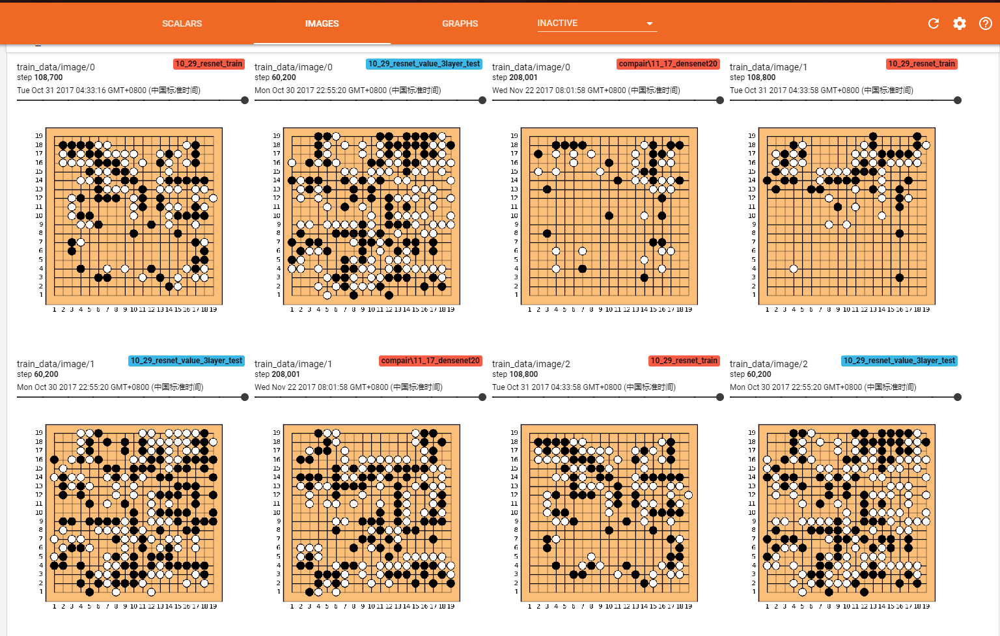
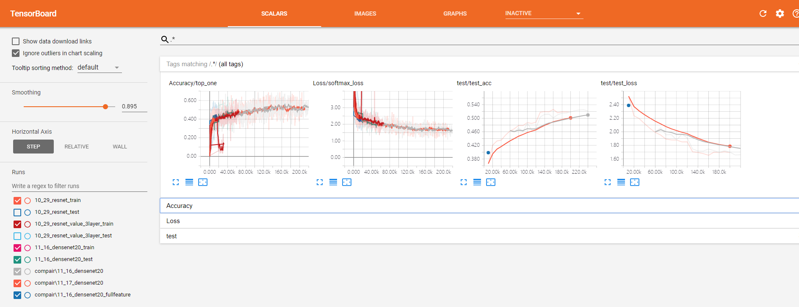

# Icy Go

This project is a experimental project trying to implement Alpha go's policy network (https://gogameguru.com/i/2016/03/deepmind-mastering-go.pdf), we did not use any look-ahead strategy (no MCTS, sorry~) , and the network continusly beating me, a go beginner.

You can download the dataset we use here and put it in "data" dir:

https://pan.baidu.com/s/1CI0vya8HB2yuhhaFck7kLg

After the data is downloaded, follow the codes in train_policy.ipynb and you should get your policy network.

We also get the tensorboard to display some interesting middle results:

Our model reaches about 53% accuracy in test set which is slightly lower than the accuracy reported by Alpha go's team (57 %):

Althrough the model is only a policy network, it's still pretty strong. Have fun messing with it~
